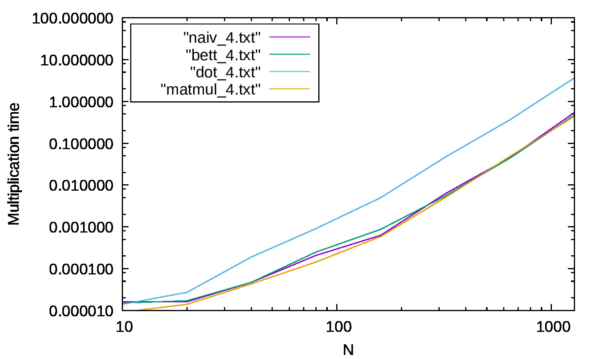
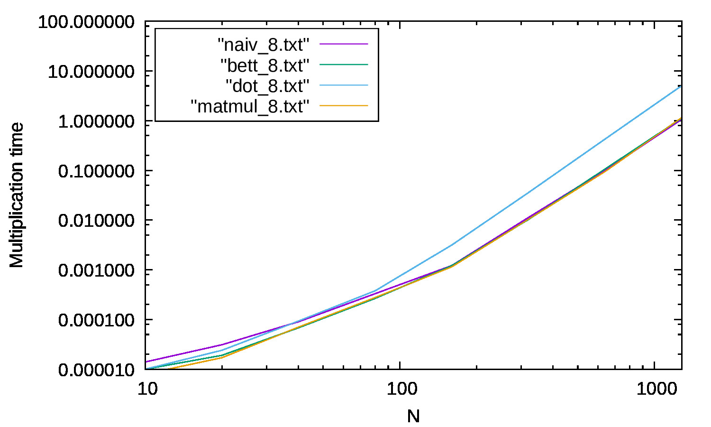
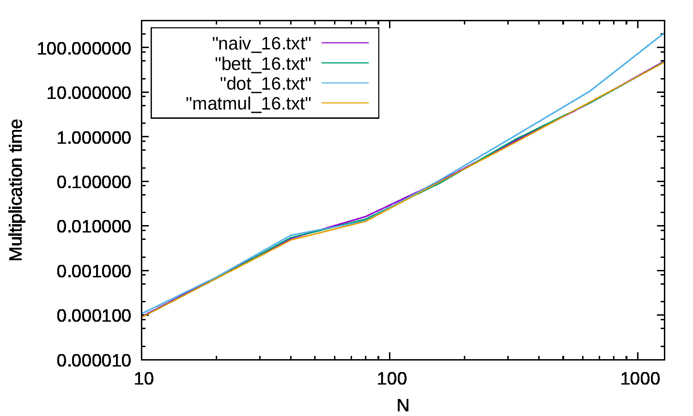

# Fortran - Mnożenie Macierzy
## Autor: Jakub Pilch
---
**1. Wstęp**

Tematem projektu była implementacja oraz przetestowanie różnych metod mnożenia macierzy. W języku Fortran zostały zaimplementowane trzy metody:
+ naiwna
+ ulepszona - wykorzystująca ułożenie danych w pamięci
+ z iloczynem skalarnym - wbudowana funkcja dot_product
Dodatkowo do porównania wzięto też pod uwagę wbudowaną funkcję Fortrana matmul(A,B).
---
**2. Testowane konfiguracje**

Zmierzono czas wykonania każdej z metod dla:
+ typów real o precyzji: **4, 8, 16**
+ rozmiarów macierzy: **10, 20 ,40 ,80, 160, 320, 640, 1280**
    
---

**3. Wyniki pomiarów**

Poniższe wykresy przedstawiają wyniki pomiarów dla poszczególnej precyzji typu real:

**Kind = 4**

**Kind = 8**

**Kind = 16**
